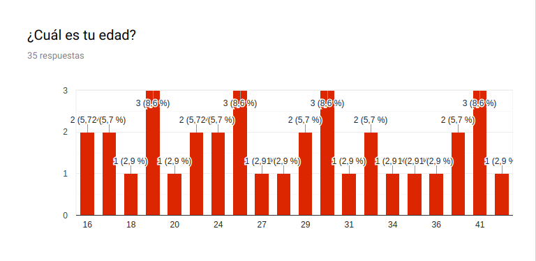
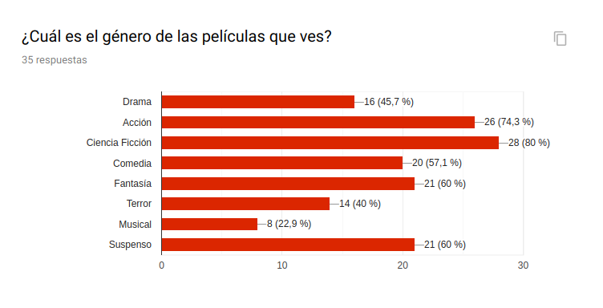
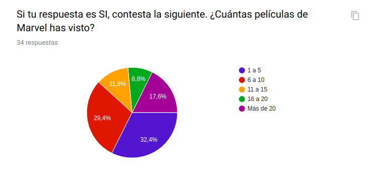
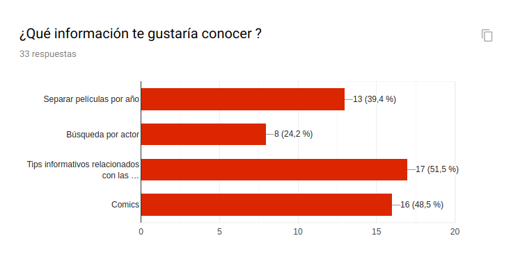

# Universo Marvel

 ## ¿Qué és Universo Marvel?

 Este es un lugar en donde puedes encontrar tus peliculas favoritas de Marvel, las que son centradas en una serie de películas de superhéroes producidas independientemente por Marvel Studios y basadas en los personajes que aparecen en las publicaciones de Marvel Comics. 
 ***

 ## Modo de uso
Una vez que ingresas al sitio puedes hacer click en la primera imagen que te aparecerá desplegada en un modal/jumbotron e ingresar a las peliculas que están prontas a estrenarse.  Luego en la pantalla principal puedes encontrar en la parte superior un menú con diferentes opciones para elegir, entre ello puedes escoger busqueda por personajes, directores, comics, etc y además tenemos la opción para que puedas ver todas las peliculas de marvel.

 

 ## Planificación

Para el desarrollo de este trabajo nos dispusimos a utilizar la plataforma [trello](https://trello.com/b/LOARgIx6/hackathon-peliculas) en donde realizamos la planificación de cada uno de los pasos a seguir, además utilizamos el metodo de _daylis_ para poder definir a diario en que ibamos, nuestros bloqueos, y por donde avanzar. 

 ## Definición: ¿Quién es nuestro usuario?

 * Como primera acción realizamos una [encuesta](https://docs.google.com/forms/d/e/1FAIpQLScT7znkUC_ahaOxAO1oIbt4ZohIdSLbCpTFav2dXC9aKJ7BoQ/viewform) desde donde pudimos recoger los siguientes datos:
 El rango de edad de las personas encuestadas:
 

 Género de peliculas favorito:
  

  Cantidad de películas de Marvel que ha visto:
   

   Información adicional que quisieran tener en la página:
  
 
